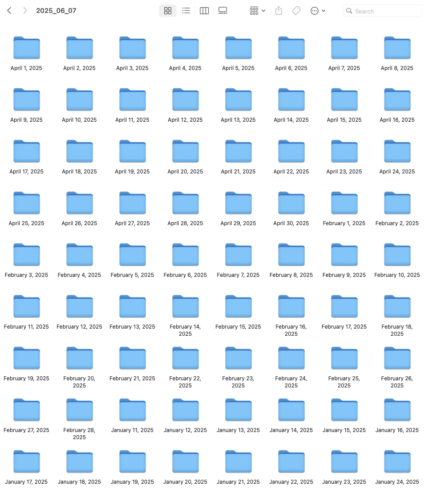

# Iphone Images organizer  

## What it does  
This script is intended to help iphone and mac users to organize imported pictures. It takes the photos and videos imported from iphone  
into a folder, and it copies them and rename them by month, so if you want to see all the pictures for a specific month, you don't need   
to open folder by folder, representing each folder a day. I would do this manually every six months and would take me a whole day.  

So, as an example (check the name of main folder, check source destination in code), from this:  
  

you get this:   
  

Its a very simple script, but it does help me and I use it in real life, so thought of sharing it to save other people time. You are welcome :) .  

## To run script:  
1. Replace the values of `SOURCE_DIR` and `DEST_DIR` in `script.py`.  
2. Execute `python3 script.py`.  

